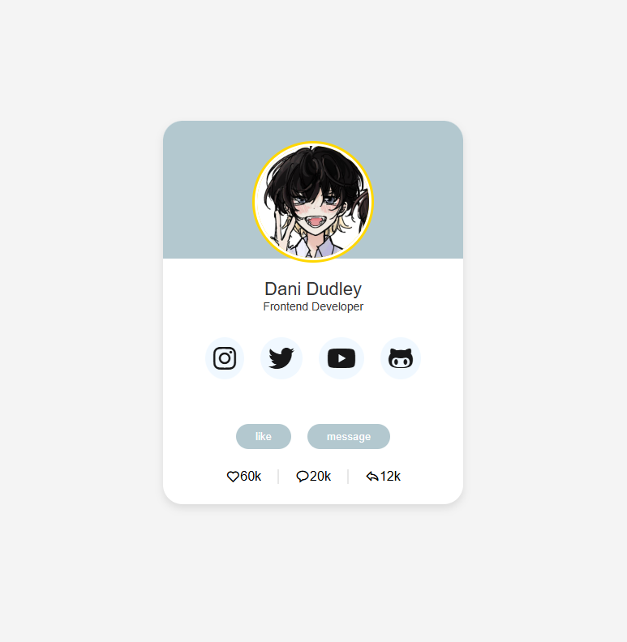

[Live Project on GitHub](https://dani1157.github.io/Responsive-Profile-Card-/)

# Profile Card UI Design

## Overview

This project is a simple, responsive profile card UI design built using HTML and CSS. The card displays a profile image, name, job title, social media links, and interactive buttons, along with some analytics. The design focuses on a clean and user-friendly interface, suitable for showcasing individual profiles.

## Table of Contents

1.  [UX](#user-experience-ux)
2.  [Design](#design)
3.  [Features](#features)
4.  [Technologies Used](#technologies-used)
5.  [Deployment](#deployment)
6.  [Testing](#testing)
    -   [Responsiveness](#responsiveness)
    -   [Code Validation](#code-validation)
    -   [Lighthouse Test](#lighthouse-test)
7.  [Libraries and Programs](#libraries-and-programs)
8.  [Credits & References](#credits--references)
9.  [Acknowledgements](#acknowledgements)

## User Experience (UX)

The purpose of this profile card is to provide a visually appealing and informative way to present personal or professional profiles.

### User Stories

*   As a user, I want to see a visually engaging profile card.
*   As a user, I want to easily access the person's social media profiles.
*   As a user, I want to understand the person's role or profession at a glance.

## Design

The design incorporates a modern and clean aesthetic with a focus on readability and easy navigation. The card is designed to be responsive and display correctly on various screen sizes.

## Features

*   **Profile Image:** Displays a circular profile image.
*   **Name and Job Title:** Shows the person's name and current job title.
*   **Social Media Links:** Provides links to various social media profiles (Instagram, X/Twitter, YouTube, GitHub).
*   **Interactive Buttons:** Includes "Like" and "Message" buttons for user interaction.
*   **Analytics Display:** Shows simple analytics like number of likes, messages, and shares.
*   **Responsive Design:** Adapts to different screen sizes for optimal viewing on desktops, tablets, and mobile devices.

## Technologies Used

*   **HTML:** Used for structuring the content of the profile card.
*   **CSS:** Used for styling the profile card and making it visually appealing.
*   **Boxicons:** Used for the analytics icons.
*   **Font Awesome:** Used for social media icons.

## Deployment

*   The project is deployed on GitHub Pages, making it accessible via a public URL.
*   GitHub is used for version control and continuous deployment.

## Testing

### Responsiveness

The website is responsive across multiple devices and screen sizes.

### Code Validation

*   HTML: Validated using the W3C Markup Validation Service to ensure proper structure and syntax.
*   CSS: Validated using the W3C CSS Validation Service to ensure proper styling and syntax.

### Lighthouse Test

Performed a Lighthouse test to check for performance, accessibility, best practices, and SEO. Results are as follows: (Include your Lighthouse score here)

## Libraries and Programs

*   Visual Studio Code: Used as the code editor.
*   Font Awesome: Used for social media icons.
*   Boxicons: Used for analytics icons.
*   Google Fonts: Used for custom typography (Poppins).
*   GitHub: Used for version control, collaboration, and deployment.

## Credits & References

*   **Font Awesome:** [https://fontawesome.com/](https://fontawesome.com/)
*   **Boxicons:** [https://boxicons.com/](https://boxicons.com/)
*   **Google Fonts:** [https://fonts.google.com/](https://fonts.google.com/)
*   Inspiration and guidance from various online resources and tutorials on UI design.

## Acknowledgements

*   Special thanks to the open-source community for providing valuable resources and tools that made this project possible.

[Return to top](#Overview)